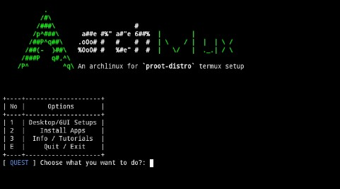

# ArchMux

Setting up your termux `proot-distro` archlinux



### Tutorials

##### Clone this repo

```bash
git clone https://github.com/c0del1ar/archmux.git
cd archmux
```

##### Installing dependencies

1. First, type `bash setup.sh` will executing a semi-auto installation packages
2. Quit and then reopen termux app
3. Type `archlogin` to login. Now, you should logged in to root user.
4. change dir to `distro-config`. Type `cd dist*` if you <sub>can't do this</sub> af.
5. Create new user: `bash set_user.sh`. This will setting up important environment too.
6. Quit and reopen, then login again to <sub>archlinux session</sub>.
7. Run `bash set_gui.sh` for final setup.
8. Last thing, don't forget to showing off to your socmed contacts as <sub>**I use Arch BTW**</sub>.


See [this file](distro-config/INFO.md) for more information.

### Contributing

Don't hesitate to contribute and support

